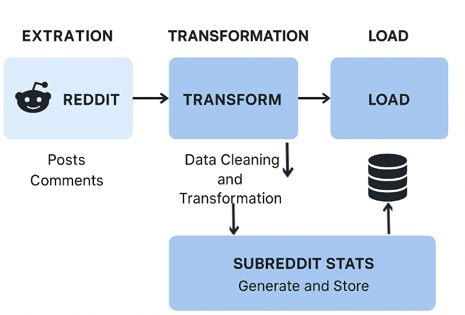
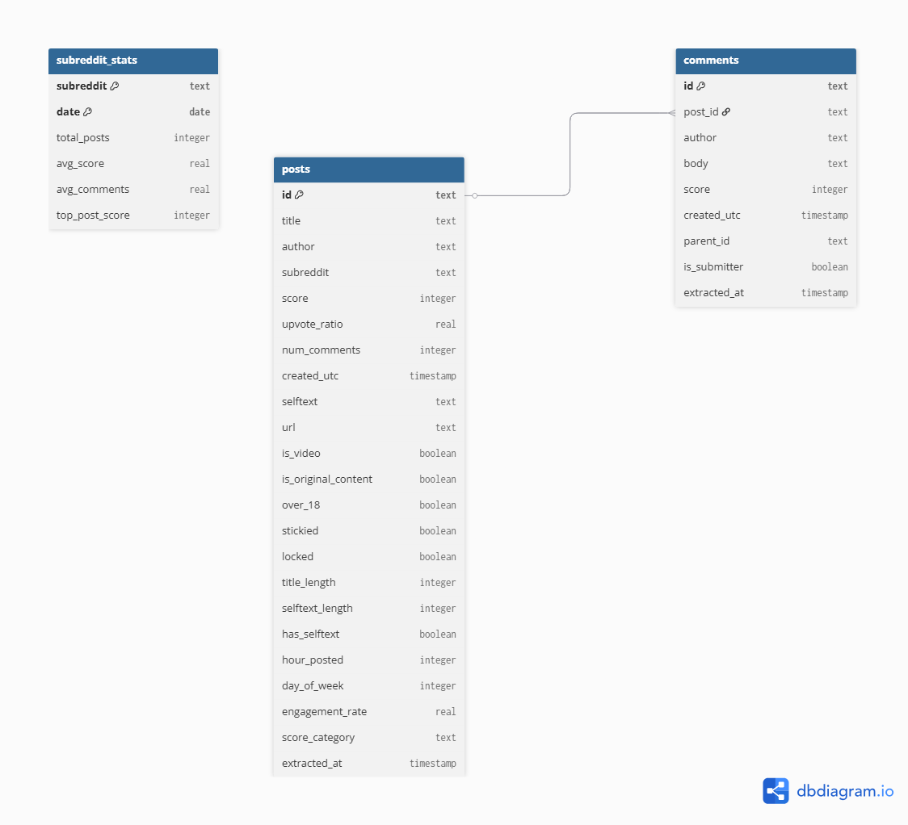

 ## FLOW

 ## Database Schema
A data engineering project implementing an ETL (Extract, Transform, Load) pipeline to collect and analyze Reddit data. Built as a learning exercise for data engineering concepts and practices.

 